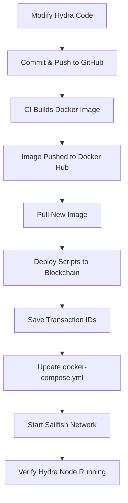

# Hydra Deployment Guide

Complete workflow for modifying Hydra, building Docker images, deploying scripts, and running with Sailfish.

---

## Overview

This guide covers the end-to-end process of:
1. Making changes to the Hydra codebase
2. Building and publishing Docker images via CI
3. Deploying Hydra scripts to the blockchain
4. Running Sailfish with the new Hydra node image

---

## Prerequisites

- Access to the Hydra repository: `/Users/hoangvu/hade/no-witness-labs/hydra`
- Docker Hub account with push access to `hadelive/hydra-node`
- Cardano wallet with funds (~50 ADA for script deployment)
- Blockfrost API key for preprod network

---

## Step 1: Modify Hydra Code

### 1.1 Make Your Changes

Navigate to the Hydra repository and make your modifications:

```bash
cd /Users/hoangvu/hade/no-witness-labs/hydra
```

Example changes might include:
- Modifying Plutus validators in `hydra-plutus/src/Hydra/Contract/`
- Updating chain logic in `hydra-node/src/Hydra/Chain/`
- Adding new features or bug fixes

### 1.2 Test Your Changes Locally

Build and test using Nix:

```bash
# Build the project
nix develop

# Run tests
cabal test

# Build hydra-node binary
cabal build hydra-node
```

### 1.3 Commit Your Changes

```bash
git add .
git commit -m "Your descriptive commit message"
git push origin your-branch-name
```

---

## Step 2: Build and Push Docker Image

### 2.1 Trigger CI Build

The repository has GitHub Actions workflows that automatically build Docker images:

**Option A: Using the Build-Only Workflow**
- Located at: `.github/workflows/docker-build-only.yml`
- Builds without pushing to verify the build succeeds
- Triggered on push to any branch

**Option B: Using the Docker Hub Push Workflow**
- Located at: `.github/workflows/docker-hub-push.yml`
- Builds AND pushes to Docker Hub
- Triggered on push to `master` or `modify-close-1` branches

### 2.2 Monitor the Build

1. Go to GitHub Actions tab in the repository
2. Watch the workflow run
3. Verify the build completes successfully
4. Note the image tag (usually the commit SHA)

### 2.3 Verify Image on Docker Hub

Check that the image was pushed to Docker Hub:
- Repository: `hadelive/hydra-node`
- Tag: `local-modified` (or your specific tag)

```bash
# Pull the image to verify
docker pull hadelive/hydra-node:local-modified

# Check the version
docker run --rm hadelive/hydra-node:local-modified --version
```

Expected output format: `1.2.0-<commit-hash>`

---

## Step 3: Deploy Hydra Scripts to Blockchain

### 3.1 Prepare for Script Deployment

Ensure you have:
- A funded Cardano wallet (signing key at `/path/to/cardano.sk`)
- Blockfrost API key saved in a file

**Create Blockfrost credentials file:**
```bash
cd /Users/hoangvu/hade/no-witness-labs/sailfish-network
echo "your-blockfrost-api-key" > blockfrost-preprod.txt
chmod 600 blockfrost-preprod.txt
```

### 3.2 Run the Hydra Node to Publish Scripts

Use the built Hydra node image to publish scripts:

```bash
docker run --rm \
  -v $(pwd)/blockfrost-preprod.txt:/blockfrost-preprod.txt \
  -v $(pwd)/keys/sailfish-node-1-cardano.sk:/keys/cardano.sk \
  hadelive/hydra-node:local-modified \
  publish-scripts \
  --blockfrost /blockfrost-preprod.txt \
  --testnet-magic 1 \
  --cardano-signing-key /keys/cardano.sk
```

### 3.3 Save Transaction IDs

The command will output 3 transaction IDs. Save them to a file:

```bash
# Example output:
a07a139461a52bc9aee344ba467673db05a535c886b1f77087e3a703f6bf07d9
ae445e0b052fbff0ea0c8a5c124639f16c27f795fd99dfcc5091cd97d69283cf
6bcc3e2eaf294ea27c076c32112ebf808ef2a041c12d3bf899afc67143e5ae59

# Save to file
echo "a07a139461a52bc9aee344ba467673db05a535c886b1f77087e3a703f6bf07d9" > hydra-scripts-tx-ids.txt
echo "ae445e0b052fbff0ea0c8a5c124639f16c27f795fd99dfcc5091cd97d69283cf" >> hydra-scripts-tx-ids.txt
echo "6bcc3e2eaf294ea27c076c32112ebf808ef2a041c12d3bf899afc67143e5ae59" >> hydra-scripts-tx-ids.txt
```

**Important:** This costs approximately 50 ADA from the signing key's wallet.

---

## Step 4: Configure Sailfish with New Scripts

### 4.1 Update docker-compose.yml

Edit the Hydra node configuration in `docker-compose.yml`:

```yaml
hydra-node:
  image: hadelive/hydra-node:local-modified  # Your new image
  # ... other config ...
  command:
    # ... other flags ...
    - --deposit-period
    - ${HYDRA_DEPOSIT_PERIOD:-600s}
    - --hydra-scripts-tx-id
    - a07a139461a52bc9aee344ba467673db05a535c886b1f77087e3a703f6bf07d9,ae445e0b052fbff0ea0c8a5c124639f16c27f795fd99dfcc5091cd97d69283cf,6bcc3e2eaf294ea27c076c32112ebf808ef2a041c12d3bf899afc67143e5ae59
```

**Important:** Use comma-separated transaction IDs in a single `--hydra-scripts-tx-id` flag.

### 4.2 Pull the New Image

```bash
docker pull hadelive/hydra-node:local-modified
```

---

## Step 5: Run Sailfish Network

### 5.1 Start the Services

```bash
cd /Users/hoangvu/hade/no-witness-labs/sailfish-network

# Stop existing services (if running)
docker-compose down

# Start all services
docker-compose up -d
```

### 5.2 Verify Services are Running

```bash
# Check all containers
docker-compose ps

# Expected output: All services should be "Up" and "healthy"
```

### 5.3 Monitor Hydra Node Logs

```bash
# Follow hydra-node logs
docker-compose logs -f hydra-node

# Check for successful initialization
docker-compose logs hydra-node | grep "hydraScriptsTxId"
```

**Success indicators:**
- ✅ No `MissingScript` errors
- ✅ Log shows: `"hydraScriptsTxId":["tx1","tx2","tx3"]`
- ✅ Node status shows `"NodeSynced"`

---

## Troubleshooting

### Issue: "Invalid option `--hydra-scripts-tx-id`"

**Cause:** Using multiple separate flags instead of comma-separated values.

**Solution:** Use the comma-separated format:
```yaml
- --hydra-scripts-tx-id
- txid1,txid2,txid3
```

NOT:
```yaml
- --hydra-scripts-tx-id
- txid1
- --hydra-scripts-tx-id
- txid2
```

### Issue: "MissingScript" Error

**Cause:** Script transaction IDs not configured or incorrect.

**Solution:**
1. Verify the transaction IDs are correct
2. Ensure transactions are confirmed on-chain
3. Check the `hydraScriptsTxId` field in run options logs

### Issue: Cardano Node Not Syncing

**Cause:** Blockchain sync takes time.

**Solution:** Wait for cardano-node to sync. Monitor progress:
```bash
docker-compose logs -f cardano-node | grep "Progress"
```

### Issue: Script Deployment Fails

**Common causes:**
- Insufficient funds in wallet
- Incorrect Blockfrost API key
- Network connectivity issues

**Solution:**
1. Check wallet balance: needs ~50 ADA
2. Verify Blockfrost key is valid
3. Check network connectivity

---

## Quick Reference

### File Locations

| File | Purpose |
|------|---------|
| `/Users/hoangvu/hade/no-witness-labs/hydra` | Hydra source code |
| `/Users/hoangvu/hade/no-witness-labs/sailfish-network` | Sailfish deployment |
| `docker-compose.yml` | Service configuration |
| `blockfrost-preprod.txt` | Blockfrost API key |
| `hydra-scripts-tx-ids.txt` | Published script transaction IDs |
| `keys/sailfish-node-1-cardano.sk` | Cardano signing key |

### Key Commands

```bash
# Build Hydra locally
cd /Users/hoangvu/hade/no-witness-labs/hydra
nix develop
cabal build hydra-node

# Pull latest image
docker pull hadelive/hydra-node:local-modified

# Publish scripts
docker run --rm \
  -v $(pwd)/blockfrost-preprod.txt:/blockfrost-preprod.txt \
  -v $(pwd)/keys/sailfish-node-1-cardano.sk:/keys/cardano.sk \
  hadelive/hydra-node:local-modified \
  publish-scripts \
  --blockfrost /blockfrost-preprod.txt \
  --testnet-magic 1 \
  --cardano-signing-key /keys/cardano.sk

# Start Sailfish
cd /Users/hoangvu/hade/no-witness-labs/sailfish-network
docker-compose up -d

# View logs
docker-compose logs -f hydra-node
```

### Access Points

| Service | URL |
|---------|-----|
| Hydra API | http://localhost:4001 |
| Grafana Dashboard | http://localhost:3000 |
| Prometheus Metrics | http://localhost:9090 |
| Cardano Node | http://localhost:30001 |

---

## Best Practices

1. **Always test locally** before pushing to CI
2. **Save transaction IDs immediately** after script deployment
3. **Monitor logs** during first startup with new scripts
4. **Keep backups** of signing keys and configuration
5. **Document changes** to Hydra validators in commit messages
6. **Version your deployments** using git tags
7. **Cost awareness**: Each script deployment costs ~50 ADA

---

## Workflow Summary



---

## Next Steps

After successful deployment:
1. Initialize a Hydra head
2. Test transactions through the API
3. Monitor performance metrics in Grafana
4. Review logs for any issues

For more information:
- [Hydra Documentation](https://hydra.family/head-protocol/)
- [Sailfish README](./README.md)
- [Script Publishing Guide](./PUBLISH_SCRIPTS_GUIDE.md)
